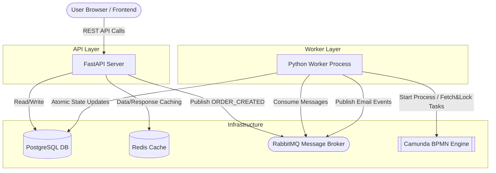

# Sansevieria System Architecture

This document describes the current architecture of the Sansevieria distributed system, including the static frontend, FastAPI backend, background workers, and supporting infrastructure.

## Architecture Diagram

## Data Flow & Component Execution

### 1. Frontend & API Communication
The **Client (Browser/Frontend)** initiates actions by sending HTTP REST requests directly to the **FastAPI Server**. 
- Fast read operations (e.g., fetching the product catalog) are instantly intercepted by **Redis**. If a cache hit occurs, raw JSON is served at sub-millisecond speeds, completely bypassing the database.
- If it's a cache miss, or a data-mutating action (like creating a cart or product), FastAPI validates the request using Pydantic, applies SQLAlchemy ORM logic, and writes definitively to **PostgreSQL**.

### 2. Disconnected Processing (RabbitMQ)
When heavy transactional operations happen, such as a user finalizing a `POST /checkout`, the FastAPI server does not block the HTTP thread to process it.
- Instead, the backend immediately inserts a new `Order` mapped to `PENDING` into PostgreSQL.
- It then publishes a structured `ORDER_CREATED` JSON payload (decorated explicitly with a unique `correlation_id`, which is the `order_id`) into **RabbitMQ**'s `order_processing_queue` exchange.
- The FastAPI server instantly returns a successful HTTP 202 to the Frontend, freeing up the user's UI.

### 3. Asynchronous Workers & BPEL Orchestration
The decoupled **Python Worker Process** continually listens to RabbitMQ.
- When it consumes the `ORDER_CREATED` event, it does *not* execute business logic directly. Instead, it fires a REST `start_process_instance` signal to the **Camunda BPMN Engine**, injecting the original `correlation_id` as the Camunda `businessKey`.
- Simultaneously, parallel threads inside the Worker continuously long-poll Camunda via `fetchAndLock` asking for queued BPMN tasks (like `validate_order`, `process_payment`, `reserve_inventory`, etc.).
- Camunda acts as the grand orchestrator, managing state workflows, parallel splits, and gateways entirely separate from Python.
- As the Worker pulls task definitions from Camunda, it applies bounded Python logic (e.g., executing a dummy HTTP payment request) using strict fault tolerance (`@with_retries`, Circuit Breakers). 

### 4. Database Mutations & Loop Closure
As the Worker completes the orchestrator's commands, it maps state changes deterministically back to **PostgreSQL**.
- Utilizing strict Row-Level Locking (`with_for_update()`), the Worker guarantees atomic mutations to the `orders` table (e.g., `PENDING` -> `PROCESSING` -> `COMPLETED`).
- On the final Camunda task completion (`send_confirmation`), the Worker drops a final `ORDER_COMPLETED` event into the `email_notification_queue` routing through **RabbitMQ** to an email notification consumer—completing the closed-loop distributed processing!
